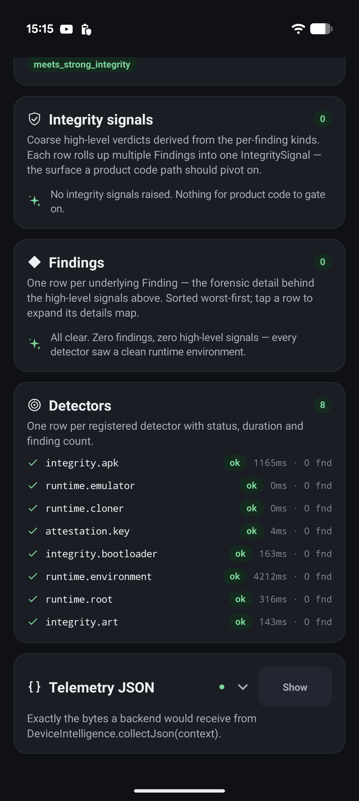
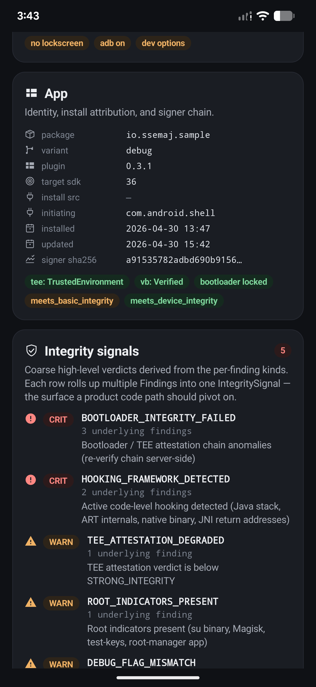
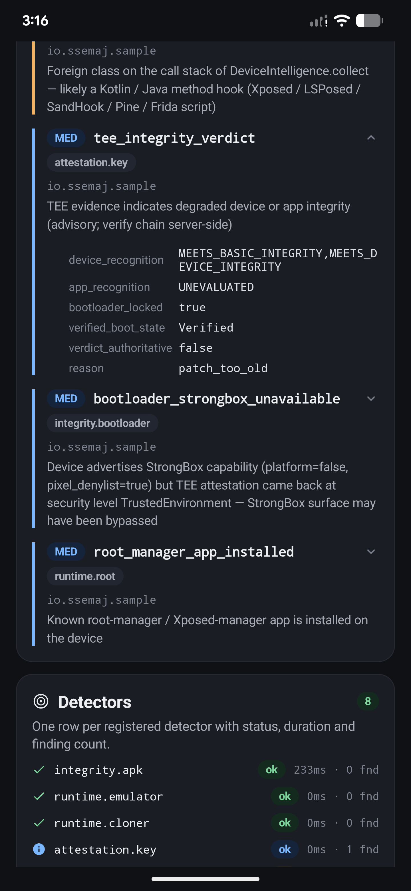

<h1 align="center">DeviceIntelligence</h1>

<p align="center">
  <strong>Open-source Android telemetry SDK that emits a structured, deterministic verdict about the device your app is running on.</strong><br/>
  <em>You decide what to do with it. The SDK observes; your backend enforces.</em>
</p>

<p align="center">
  <a href="LICENSE"></a>
  <a href="https://jitpack.io/#iamjosephmj/DeviceIntelligence"></a>
  
  
  
</p>

<p align="center">
  
  
  
</p>

---

## What you get

A small public API that returns one stable type — `TelemetryReport` — collapsible into a high-level vocabulary of **`IntegritySignal`** values. Your code branches on the signals; the SDK doesn't make policy decisions.

```kotlin
val signals = DeviceIntelligence.collect(context).toIntegritySignals()

when {
    IntegritySignal.HARDWARE_ATTESTED_USERSPACE_TAMPERED in signals -> hardBlock()
    IntegritySignal.HOOKING_FRAMEWORK_DETECTED          in signals -> denyPayment()
    IntegritySignal.REMOTE_INTERACTION_HIGH_RISK        in signals -> denyPayment()
    IntegritySignal.ROOT_INDICATORS_PRESENT             in signals -> warnUser()
    IntegritySignal.EMULATOR_DETECTED                   in signals -> requireExtra2FA()
    else                                                            -> allow()
}
```

## Install

Distributed via [JitPack](https://jitpack.io/#iamjosephmj/DeviceIntelligence).

**`settings.gradle.kts`**

```kotlin
pluginManagement {
    repositories { maven("https://jitpack.io"); gradlePluginPortal(); google() }
    resolutionStrategy {
        eachPlugin {
            if (requested.id.id == "io.ssemaj.deviceintelligence") {
                useModule(
                    "com.github.iamjosephmj.DeviceIntelligence:" +
                        "deviceintelligence-gradle:${requested.version}"
                )
            }
        }
    }
}

dependencyResolutionManagement {
    repositories { google(); mavenCentral(); maven("https://jitpack.io") }
}
```

**`app/build.gradle.kts`**

```kotlin
plugins {
    id("io.ssemaj.deviceintelligence") version "1.2.0-alpha01"
}
```

Native binaries ship for `arm64-v8a`, `x86_64`, and `armeabi-v7a`. `kotlinx-coroutines-android` is the only runtime dependency.

## Public API

Five entry points. Pick the one that matches how your app needs to consume the verdict.

### 1. One-shot collect

Your app starts a sensitive flow, you want one structured snapshot.

```kotlin
lifecycleScope.launch {
    val report  = DeviceIntelligence.collect(context)       // TelemetryReport
    val json    = DeviceIntelligence.collectJson(context)   // canonical JSON
    val signals = report.toIntegritySignals()               // Set<IntegritySignal>
}
```

### 2. Periodic observe

Long-running session — emit a fresh snapshot every N seconds so you catch a hook that attaches mid-flow.

```kotlin
DeviceIntelligence.observe(context, interval = 2.seconds)
    .onEach { report -> render(report.toIntegritySignals()) }
    .launchIn(lifecycleScope)
```

### 3. Cumulative session observe

Like `observe()` but accumulates findings. A transient hook that fires once and detaches stays visible with `stillActive = false` — useful when your UI or backend correlation should never lose sight of a signal the moment it stops appearing.

```kotlin
DeviceIntelligence.observeSession(context, interval = 2.seconds)
    .onEach { session: SessionFindings ->
        render(session.findings)             // List<TrackedFinding>
        ship(session.toJson())               // canonical wire format
    }
    .launchIn(lifecycleScope)
```

Each `TrackedFinding` carries `firstSeenAtEpochMs`, `lastSeenAtEpochMs`, `observationCount`, and `stillActive`.

### 4. Live interaction events (1.2.0+)

A hot stream of events about what's interacting with the device right now — remote-control apps, accessibility-service abuse, screen-capture activity, input-injection. Subscribe from any lifecycle scope and react in real time, e.g. abort a payment if a high-risk event fires mid-checkout.

```kotlin
DeviceIntelligence.interactionEvents
    .filter { it.severity == InteractionSeverity.HIGH }
    .onEach { abortSensitiveFlow(it) }
    .launchIn(lifecycleScope)
```

`SessionFindings.remoteInteraction` exposes the same data as a rolled-up snapshot for backend wire-format consumers.

### 5. Java / synchronous boundary

For Java consumers, worker threads, JNI bridges.

```java
TelemetryReport report = DeviceIntelligence.collectBlocking(context);
String json = DeviceIntelligence.collectJsonBlocking(context);
```

## Signal reference

`IntegritySignal` is the consumer-facing vocabulary. Branch on these; the underlying `Finding` evidence is still available via `report.toIntegritySignalReport().evidence[signal]` when you need forensic detail.

| Signal | What it means for your decision |
|---|---|
| `HARDWARE_ATTESTED_USERSPACE_TAMPERED` | **Highest-confidence compromise.** Hardware attestation says the device looks clean, but a userspace hook is active in the same report. Block. |
| `HOOKING_FRAMEWORK_DETECTED` | Active code-level hooking is happening in your process (Frida, Xposed/LSPosed, Pine, SandHook, runtime DEX injection, RWX trampolines). Block sensitive flows. |
| `REMOTE_INTERACTION_HIGH_RISK` | Something is actively interacting with the device that shouldn't be — a non-allowlisted accessibility service with gesture-injection, a remote-control app capability match, virtual input being dispatched, or unknown screen capture in progress. Block. |
| `INJECTED_NATIVE_CODE` | An unknown native library or anonymous executable mapping is loaded. Precondition for hooking but not yet proof of one — escalate based on your risk appetite. |
| `ROOT_INDICATORS_PRESENT` | Root tooling is on the device (Magisk, `su`, root-manager apps, Shamiko bypass, MagiskTrustUserCerts TLS-MITM). For TLS-MITM specifically, treat as hard block. |
| `BOOTLOADER_INTEGRITY_FAILED` | The hardware key-attestation chain has structural anomalies, or the device claims StrongBox but attests at a lower level. Treat as bootloader-tampered. |
| `TEE_ATTESTATION_DEGRADED` | The local advisory verdict on the attestation chain came back below `MEETS_STRONG_INTEGRITY`. Have your backend re-verify the raw chain before deciding. |
| `APK_TAMPERED` | The APK on disk doesn't match the build-time fingerprint — repackaged, signer mismatch, or installed from an unallowed source. Block. |
| `APK_FINGERPRINT_UNAVAILABLE` | The build-time fingerprint asset is missing or corrupt. The SDK couldn't make a verdict either way — treat as a strong "couldn't verify" signal. |
| `EMULATOR_DETECTED` | CPU-instruction-level signals indicate the app is running on an emulator or hypervisor. Require step-up authentication. |
| `APP_CLONED` | The app is running inside a cloner (foreign APK mappings, mount-namespace inconsistencies, UID mismatches). Block or require step-up. |
| `DEBUGGER_ATTACHED` | A JVM debugger or `ptrace` tracer is attached to the process. Block sensitive flows. |
| `DEBUG_FLAG_MISMATCH` | The app's `FLAG_DEBUGGABLE` disagrees with `ro.debuggable`. Indicates the APK was tampered or the device is in an unexpected build state. |
| `REMOTE_INTERACTION_AMBIENT_RISK` | A remote-control or notification-listener tool is installed/granted but not currently asserting control (e.g. TeamViewer present, recent A11y install). One factor among several — use in risk scoring, not as a sole blocker. |
| `REMOTE_INTERACTION_CONTEXT` | Operational context only — TalkBack enabled, external keyboard paired, VPN active, MDM provisioned. **Never block on this signal.** Useful for explaining other signals (e.g. distinguishing a Chromebook keyboard from input injection). |

> **Not a RASP.** The SDK does not block sessions, kill processes, or interrupt any flow. It observes and reports. Build enforcement on the JSON your backend ingests; keep policy off-device.

## Permissions

| Permission | Required by | Default | Opt-out / opt-in |
|---|---|---|---|
| `INTERNET` | Anonymous analytics drain (see below) | on | `disableAnalytics.set(true)` |
| `QUERY_ALL_PACKAGES` | `ROOT_INDICATORS_PRESENT` root-manager-app channel | on | Strip via `tools:node="remove"` |
| `ACCESS_NETWORK_STATE` | `DeviceContext.vpnActive` | off | `enableVpnDetection.set(true)` |
| `USE_BIOMETRIC` | `DeviceContext.biometricsEnrolled` | off | `enableBiometricsDetection.set(true)` |

Opted-out fields report `null` (not `false`).

**Analytics.** The SDK sends anonymous device-hardware telemetry (ABI, API level, manufacturer, model, SoC, detector result codes) to improve detector accuracy across the long tail of OEM devices. **No PII, no package names, no addresses.** `client_id` is a one-way SHA-256 of `ro.build.fingerprint`. Disable any time with `deviceintelligence { disableAnalytics.set(true) }`.

## Documentation

- [`docs/DETECTORS.md`](docs/DETECTORS.md) — per-detector reference with sample tripped JSON
- [`SECURITY.md`](SECURITY.md) — vulnerability disclosure process and supported-versions policy

## License

Apache 2.0 — see [`LICENSE`](LICENSE).
