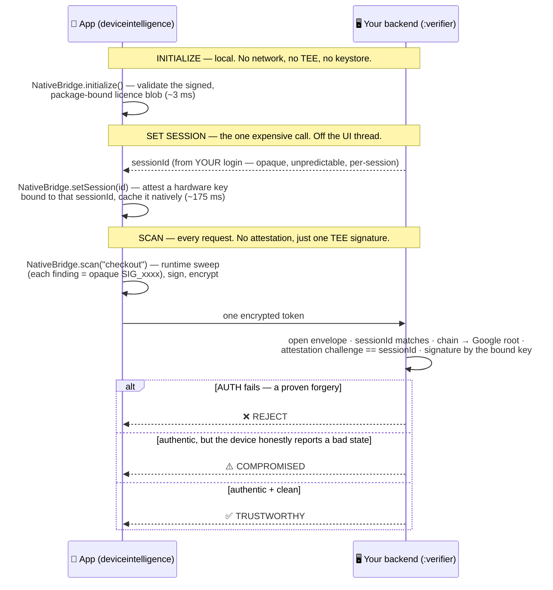

# Project DeviceIntelligence — deviceintelligence

A **detection-only** Android device-integrity library, built **attest-once**: the expensive
hardware key attestation is paid a single time, when you hand the SDK your session, and every
scan after that is a cheap signature + runtime sweep. **There is no on-device enforcement and
no on-device verdict — the device *reports*, the *backend decides*.**

There is **no SDK-owned network endpoint** and nothing to fetch before `initialize()`.

This README is the integration guide. It walks the whole system end to end:

1. [Provision the keys](#1-provision-the-keys) — one keypair, two halves, two owners
2. [Integrate — Frontend (Android)](#integrate--frontend-android) — one plugin, three calls
3. [How a token is generated](#how-a-token-is-generated) — what `scan()` actually produces
4. [Integrate — Backend (server)](#integrate--backend-server) — verify and decide

## Architecture at a glance


```mermaid
sequenceDiagram
    participant App as 📱 App (deviceintelligence)
    participant BE as 🖥️ Your backend (:verifier)

    note over App,BE: INITIALIZE — local. No network, no TEE, no keystore.
    App->>App: NativeBridge.initialize() — validate the signed,<br/>package-bound licence blob (~3 ms)

    note over App,BE: SET SESSION — the one expensive call. Off the UI thread.
    BE-->>App: sessionId (from YOUR login — opaque, unpredictable, per-session)
    App->>App: NativeBridge.setSession(id) — attest a hardware key<br/>bound to that sessionId, cache it natively (~175 ms)

    note over App,BE: SCAN — every request. No attestation, just one TEE signature.
    App->>App: NativeBridge.scan("checkout") — runtime sweep<br/>(each finding = opaque SIG_xxxx), sign, encrypt
    App->>BE: one encrypted token
    BE->>BE: open envelope · sessionId matches · chain → Google root ·<br/>attestation challenge == sessionId · signature by the bound key
    alt AUTH fails — a proven forgery
        BE-->>App: ❌ REJECT
    else authentic, but the device honestly reports a bad state
        BE-->>App: ⚠️ COMPROMISED
    else authentic + clean
        BE-->>App: ✅ TRUSTWORTHY
    end
```

---

## 1. Provision the keys

DeviceIntelligence needs exactly one keypair (X25519), generated **on your machine at provisioning time** —
never in a consumer build, never on a device. Two halves:

| Output | Where it lives | Secrecy |
|---|---|---|
| `server.key` | the **app**, as an asset at `assets/tech.thessemaj.deviceintelligence/server.key` | **PUBLIC** — safe to embed |
| `server-priv-<epoch>.pem` | the **backend** | **SECRET** — never ship, never commit; production keeps it in an HSM/KSM |

The device holds only the *public* half (inside the licence blob), so there is no
extractable transport secret on the phone. The private half is what opens scan tokens.

Generate with the tools flow (also mints an RVN2 blob bound to your application id —
set the application id and your publisher signing key there):

```sh
python3 tools/keys/gen-dev-licence.py <applicationId> <out-dir>   # dev flow
# or: tools/keys/gen-licence-key.sh                                # standalone flow
```

Then copy `server.key` into your app's `assets/tech.thessemaj.deviceintelligence/`.
A signed **RVN2** blob binds the licence to one application id + signing cert; the
runtime fails fast on a repackaged or re-signed APK.

## Integrate — Frontend (Android)

Three calls, one Gradle plugin, no network on the device side. The complete working
wiring is in [`samples/minimal`).

### 1. Make the plugin resolvable

The plugin and the runtime AAR ship as **GitHub release assets**, not from Maven
Central, so Gradle has to be told where to look. This is the step that is easy to
miss — without it, `id("tech.thessemaj.deviceintelligence")` fails to resolve.

```kotlin
// settings.gradle.kts
pluginManagement {
    repositories {
        gradlePluginPortal()
        google()
        mavenCentral()
        maven("https://your-internal-mirror/releases")   // where you host the plugin jar
    }
}
dependencyResolutionManagement {
    repositories {
        google()
        mavenCentral()
        maven("https://your-internal-mirror/releases")   // and the deviceintelligence AAR + per-ABI .so
    }
}
```

Assets are `deviceintelligence-<version>.aar`, the plugin jar, `libdicore-<abi>.so` for
`arm64-v8a` / `armeabi-v7a` / `x86_64`, and `SHA256SUMS`. Mirror them, or point at
the AAR directly — see [deviceintelligence/README) for the offline options.

### 2. Apply the plugin

```kotlin
// app/build.gradle.kts
plugins {
    id("com.android.application")
    id("tech.thessemaj.deviceintelligence") version "0.5.2"
}
```

That is the whole integration. The plugin adds the matching runtime AAR at **its own
version**, so plugin and runtime cannot drift, and it hashes your APK at build time
and bakes the baseline in. **You do not need a `deviceintelligence { }` block** — every option is
opt-in and defaults to off. If you want one:

```kotlin
deviceintelligence {
    verbose.set(true)                        // log what the plugin registers, at configuration time
    disableAutoRuntimeDependency.set(true)   // ONLY if you pin the AAR version yourself
    appBundle { enabled.set(true) }          // bake into the AAB instead of the APK
}
```

> The plugin **re-signs your APK after packaging**, so every build type you ship needs
> a fully resolved `signingConfig`. A build type without one fails the build with an
> explicit message rather than shipping an app whose baseline does not match itself.

### 3. Install the licence asset

Copy the PUBLIC half from [step 1](#1-provision-the-keys) into your app:

```
app/src/main/assets/tech.thessemaj.deviceintelligence/server.deviceintelligence
```

`initialize()` reads that exact path. A missing or unparseable blob is the one failure
`scan()` cannot recover from — there is no key to encrypt tokens to.

### 4. Call three methods

`tech.thessemaj.deviceintelligence.api.DeviceIntelligence` is the API to use. All three are `suspend` and hop to
`Dispatchers.IO` themselves, so none of them blocks your UI thread.

```kotlin
import tech.thessemaj.deviceintelligence.api.DeviceIntelligence

// (a) ONCE at startup, e.g. Application.onCreate in a coroutine.
//     Local only: no network, no TEE, no keystore. Cheap (~3 ms).
DeviceIntelligence.initialize(application)

// (b) ONCE per session, right after YOUR login returns.
//     This is the expensive call: one TEE/StrongBox keygen, attested to sessionId.
DeviceIntelligence.setSession(sessionId)

// (c) PER REQUEST you want to protect. Cheap — no keygen, no attestation.
val token = DeviceIntelligence.scan("checkout")
if (token.isNotEmpty()) {
    myBackend.submit(token)   // opaque to the app; only your backend can open it
}
```

**Do not bail out when (a) or (b) returns `false`.** That is the most common
integration mistake. A rejected licence or a failed keygen still lets `scan()` emit a
**degraded** token — one that names the failure and carries the detector findings —
and your backend grades it. Silence is what an attacker wants: at the backend, no
token is indistinguishable from a network error or an app with no SDK at all. Send
the token and let the server decide.

| Call | Returns `false` when | What you do |
|---|---|---|
| `initialize` | the licence blob is missing, unparseable, bound to another package, or expired | carry on; scan reports it as `SIG_0054` |
| `setSession` | the TEE/StrongBox keygen failed or was hooked | carry on; scan reports it as `SIG_0052` |
| `scan` | returns `""` only when the blob never parsed — the server public key lives inside it, so there is nothing to encrypt to | nothing to send |

> **`sessionId` is load-bearing.** It MUST be opaque, unpredictable, at least 128 bits,
> issued per session by your backend, and never derived from a stable identifier (user
> id, device id, email). It is the value the hardware attestation binds to, so a
> guessable or shared id **silently removes replay protection** — there is no error and
> no signal, because the SDK cannot detect it. If yours cannot meet that bar, pass a
> fresh per-request server nonce instead: `DeviceIntelligence.scan(name, nonce)`.

### Calling from Java, or managing your own threads

`tech.thessemaj.deviceintelligence.dx.NativeBridge` is the blocking core underneath the facade — same three methods,
no coroutines, and `NativeBridge.initialize()` takes no `Application` (the shim is registered
separately, via `NativeBridge.s(FrameworkShim::class.java)`, once before anything else).
**`NativeBridge.setSession` must not run on the UI thread.** Use it only when the facade does
not fit; otherwise prefer `DeviceIntelligence`.

### What you never do

You never inspect, parse or branch on a token in the app. It is encrypted to your
server key and opaque by design; anything the app could read, an attacker can rewrite.

---

## How a token is generated

Understanding the lifecycle makes every integration decision obvious. Three phases,
only the third runs more than once:

**INITIALIZE (once, local).** Validate the licence blob and cache the server public
key from it. No network, no TEE, no keystore — milliseconds.

**SET SESSION (once per session).** Your backend's `sessionId` becomes the
**attestation challenge** of a fresh TEE/StrongBox key: Android bakes the challenge
*inside* the certificate the device mints, so the key is now cryptographically bound
to that session. The chain is cached in native process memory. This is the one
expensive call (~175 ms), deliberately kept off the request path.

**SCAN (every request).** In one call the native core:

1. runs the detector sweep — every finding becomes an **opaque code** (`SIG_xxxx`);
   the app never learns what they mean,
2. builds a compact JSON `scan` document (schemaVersion 4) with the findings,
   self-reported device properties and the app identity,
3. **signs** it with the attested TEE key — an ECDSA signature a captured token
   cannot forge, because the key cannot leave the TEE,
4. **encrypts** to the server public key from the licence blob (v2 ECIES), and
   returns the token string: `"2:"` + hex of

   ```
   version(1) || epoch(1) || eph_pub(32) || nonce(12) || ct || tag(16)
   ```

   opened server-side with `X25519(server_priv, eph_pub)` → `HKDF-SHA256` →
   `AES-256-GCM`. The full wire contract — envelope, document, binding — is
   [`tools/server/SCHEMA.md`).

**Bootstrap vs steady-state.** The **first** scan of a cold start additionally
carries the full attestation certificate chain (`bootstrap: true`) so the backend can
pin the key to the session. Every later scan carries only `fpHash` and signs with the
attested key — cheaper, and legitimately carrying less. Your backend must expect both.

---

## Integrate — Backend (server)

Your backend issues the session ids, verifies the tokens, and decides. Two drop-in
options, identical logic:

### Option A — JVM (`:verifier`, recommended for a JVM backend)

Zero runtime dependencies (JDK crypto + a tiny hand-rolled JSON/DER reader); never shipped to
the app. Full guide: [verifier/README).

```kotlin
import tech.thessemaj.deviceintelligence.verifier.*

// Construct once and reuse — it caches parsed server keys.
val verifier = ScanVerifier()

// One entry point for every scan.
//   token             — the "2:…" string the app posted
//   issuedSessionId   — the session id YOUR backend issued for this session
//   serverPrivateKey  — server-priv-<epoch>.pem, as a stream (PEM or raw DER)
//   savedSession      — the ScanSession you stored at bootstrap; null on the
//                       FIRST scan of a cold start (that scan carries the
//                       attestation chain and hands you a fresh ScanSession).
val result = verifier.verifyScan(
    token = token,
    issuedSessionId = sessionId,
    serverPriv = serverPrivateKey,
    session = savedSession,
)

// A successful bootstrap pins the session: store it on YOUR session record
// and pass it back on every later scan. This is what keeps the verifier
// stateless — it owns no per-device storage.
if (result.bootstrap && result.ok) {
    savedSession = result.session
}

// The decision. `decision` applies the documented default policy; see the
// table below for the two graded axes behind it.
when (result.decision) {
    Decision.TRUSTWORTHY -> allow()                       // authentic + clean device + no blocking signal
    Decision.COMPROMISED -> stepUp(result.blockingSignals) // authentic, but untrustworthy device or findings
    Decision.REJECT      -> deny(result.reason)            // a proven forgery — do not trust the contents
}
```

Custom policy (tolerate a signal, require StrongBox, step up on HIGH) does not go
through `decision` — read the graded axes directly and decide yourself:

```kotlin
val result = verifier.verifyScan(token, sessionId, serverPrivateKey, savedSession)

if (!result.ok)                          deny()                   // AUTH: proven forgery
else if (!result.deviceIntegrityOk)      stepUp()                 // INTEGRITY: bad boot state
else if (result.signals.any { it.blocking }) stepUp(result.signals) // policy: blocking findings
else                                     allow()
```

`ScanVerifier` **grades, it does not decide**, and the two axes are deliberately separate:

| | meaning | typical response |
|---|---|---|
| `ok == false` | AUTH — a proven forgery: untrusted chain, revoked keybox, one keybox across both security levels, attested properties contradicting the self-report, props claiming a boot the TEE denies | REJECT |
| `deviceIntegrityOk == false` | INTEGRITY — an honest report of an untrustworthy device: no hardware backing, unverified boot, unlocked | COMPROMISED |

Collapsing them into one boolean is how a rooted, prop-spoofing device reads as clean.

### Option B — Python reference (`tools/server/verify_token.py`)

```sh
python3 tools/server/verify_token.py --scan @scan.token --session-id @session-id.txt --key server-priv-0.pem
```

**The contract** (envelope, the scan document, the carried `ScanSession`, the decision rules)
is specified in [`tools/server/SCHEMA.md`). The
backend owns three things the device does not: the **server key**, the
**`signals-registry`** (code→meaning), and the **policy** (which signals block, at what
severity).

### The three decisions

- **REJECT** — not a genuine, fresh, hardware-signed binding (forged/replayed/unbound token).
- **COMPROMISED** — authentic token, but the TEE reports a bad boot state or a blocking signal fired.
- **TRUSTWORTHY** — authentic *and* the TEE reports a clean device *and* no blocking signal.

---

## Operating it

**Threading.** `initialize()` is cheap and local; call it on startup wherever you like.
`setSession(id)` blocks on the TEE and **must not run on the UI thread**. `scan(name)` is
fast but still does one TEE-resident signature, so keep it off the main thread on a request
path you care about.

**Cost.** Measured on a Pixel 6 Pro, release build:

| Call | Typical | Notes |
|---|---|---|
| `initialize()` | ~3 ms | Licence blob only. No network, no TEE, no keystore. |
| `setSession(id)` | ~150–175 ms | One hardware attestation. Up to a couple of seconds where StrongBox is backed by a slow secure element. |
| `scan(name)`, first of a cold start | ~400 ms | Carries the attestation chain (`bootstrap`). |
| `scan(name)`, thereafter | ~130–170 ms | Signature + runtime sweep. |

**Failure modes worth handling.** `initialize()` returns `false` when the licence blob is
missing, unsigned, expired, or bound to a different package — a build/packaging problem, not
an attack. `setSession()` returns `false` when TEE key generation fails, and `scan()` will
still return a degraded token naming it. An empty token (`""`) is not a clean device: treat
"no token" as a signal in its own right, because a genuine device almost always returns one.

**Compatibility.** `minSdk` 28; hardware attestation uses StrongBox where available and
falls back to TEE. The backend grades the assurance level it actually got rather than
requiring StrongBox.

## The design — why the attestation binds to your session

An Android key-attestation challenge is baked *inside* a certificate the device mints
locally, so it can only bind to a server value that already exists on the device — which is
why the SDK cannot attest during `initialize()`, and why it does not need a round-trip of
its own either: your login already produced exactly such a value, the session id. Binding
the attestation to it is what makes a captured token useless against any other session.
Two earlier designs were tried and withdrawn — a blocking pre-call round-trip, and a
device-generated nonce plus a stateful seen-keys table on the backend.

## Repo layout — who uses what

| Path | Side | What it is |
|------|------|-----------|
| [`deviceintelligence/`) | **device** | The runtime AAR + `libdicore.so`. Exports `tech.thessemaj.deviceintelligence.dx.NativeBridge` (`initialize`/`setSession`/`scan`). This is what your **app** depends on. |
| [`deviceintelligence-gradle/`) | **device** | The Gradle plugin (`id("tech.thessemaj.deviceintelligence")`) that wires the AAR + native libs into a consumer app. |
| [`deviceintelligence-whitebox/`) | **build** | Mints the licence keypair: `server.deviceintelligence` for the app, the private half for your backend. |
| [`verifier/`) | **backend** | The **token verifier** (Kotlin/JVM, zero-dep). Drop-in for *your server*: token + session id → decision. |
| [`tools/server/`) | **backend** | Python reference verifier + [`SCHEMA.md`) — the full device↔backend wire contract. |
| [`tools/registry/`) | **backend** | `signals-registry.json` — the `SIG_xxxx` → meaning source of truth (copied into `:verifier` at build). |
| [`samples/minimal/`) | **both** | The **device testbed** — folds device + backend into one process so the loop closes on-device. What QA drives, and what the red-team catalogue attacks. |
| [`tools/`) | tooling | Build, release and QA: `qa/` `registry/` `keys/` `crl/` `release/` `obfuscator/`. |

## Build, test & release

| | |
|---|---|
| [`tools/qa/`) | Clean-device false-positive harness, native unit tests, and the naming-drift gate. |
| [`tools/registry/`) | The signal registry and its generator; `gen-signal-ids.py --check` is the drift gate. |
| [`tools/keys/`), [`tools/crl/`) | Licence key generation and the revocation list baked into the AAR. |
| [`tools/obfuscator/`) | The `deviceintelligence-obf` LLVM pass used for release builds. |

Releases are built locally and published as GitHub release assets — the obfuscated AAR, the
plugin and baker jars, per-ABI `libdicore.so`, and `SHA256SUMS`. See
`.github/workflows/release.yml` for the exact steps and the obfuscation verification gate.

## Reference

| | |
|---|---|
| [`deviceintelligence/README`) | The device runtime AAR and the `K` API. |
| [`verifier/README`) | The JVM backend verifier. |
| [`tools/server/SCHEMA.md`) | The full device↔backend wire contract. |
| [`samples/minimal/README`) | The reference end-to-end integration. |

---

## Signal catalogue — every `INTEL_` code

Detectors emit granular findings; the runtime collapses them into opaque `INTEL_xxxx` codes.
This is the complete catalogue — reference material for whoever writes backend policy.
The source of truth is [`tools/registry/signals-registry.json`](tools/registry/signals-registry.json)
(**append-only**: codes are never reused or renumbered, and a retired signal keeps its row).
This table is parsed by `tools/registry/gen-signal-catalogue.py`, so keep the format stable.

### Attestation — hardware identity & verified boot

| Code | detector | kind | Sev | Meaning | Reach — what it unlocks |
|---|---|---|---|---|---|
| `INTEL_0000` | attestation | `attestation_critical` | CRITICAL | TEE key-attestation cross-checks failed (keybox reuse / device-property honeypot / revoked keybox). | **Forged hardware identity** — spoof Play Integrity `DEVICE`/`STRONG`, impersonate a genuine device, defeat hardware-key-bound checks. |
| `INTEL_0030` | attestation | `verified_boot_prop_spoof` | CRITICAL | Device self-reports green/locked boot while its hardware RootOfTrust says otherwise (TrickyStore / IntegrityBox / PIF). | **Verified-boot / Play Integrity spoofing** — a rooted device masquerades as a locked, uncompromised one. |
| `INTEL_0032` | attestation | `keybox_cross_level_reuse` | CRITICAL | StrongBox and TEE chains were signed by the *same* batch key — physically impossible on genuine hardware. | **Injected leaked keybox** — spoof hardware attestation end-to-end, defeat Play Integrity `STRONG`. |
| `INTEL_0033` | attestation | `strongbox_chain_unavailable` | VERY_LOW | StrongBox appears available but no StrongBox chain was produced — leaf claims StrongBox, or the device reports StrongBox hardware yet fell back to TEE (fail-closed). | Cross-level keybox-reuse check (`INTEL_0032`) **could not run** — possible attestation-downgrade evasion (also fires transiently on genuine HW). |
| `INTEL_0044` | attestation | `software_attested_environment` | CRITICAL | KeyDescription explicitly reports `securityLevel=Software(0)` — no hardware root of trust. | **Emulator / software keystore** — no TEE at all. |
| `INTEL_0045` | attestation | `app_identity_mismatch` | CRITICAL | The self-reported package/signer disagrees with the TEE-attested `attestationApplicationId` (tag 709). | **Repackaged or rehosted APK** — the running code is not what the attested key was issued to. |
| `INTEL_0046` | attestation | `app_not_licensed` | HIGH | Identity is self-consistent but the signing digest is not in the licensed set. | **Licensing**, not tampering — kept separate so a stale licence table can't read as a compromise. |
| `INTEL_0047` | attestation | `security_patch_stale` | MEDIUM | The **oldest** attested patch level (os/vendor/boot) is older than the backend policy window (default 365d). | **Unpatched device** — known CVEs. Backend-computed, so the window retunes without an app release. |
| `INTEL_0048` | attestation | `patch_level_self_report_mismatch` | HIGH | Self-reported patch, truncated to `YYYY-MM`, contradicts the attested `osPatchLevel`. | **Prop spoofer** faking a current patch to look healthy — same family as INTEL_0030. |
| `INTEL_0052` | attestation | `session_attestation_unavailable` | CRITICAL | `setSession()` could not produce a hardware-attested key — the TEE/StrongBox keygen failed or was hooked — so the scan carries no chain and cannot be bound to the session. Emitted degraded rather than suppressed. | **Unbound token** — nothing ties this scan to a session or to hardware, so it is replayable against another session. A hook engine that breaks keygen produces exactly this, which is why it is reported rather than met with silence. |
| `INTEL_0053` | attestation | `scan_without_session` | CRITICAL | `scan()` ran with no session id prepared: `setSession()` was never called, it failed, or it named a different session. | **Unbound token** — no session binding at all, so the result cannot be attributed to a login and is replayable. Also fires on an integration that simply skipped `setSession`, so rule out a wiring fault before reading it as an attack. |
| `INTEL_0054` | attestation | `licence_rejected_at_scan` | HIGH | The licence blob parsed but was rejected at scan time — expired, or bound to a different package. | **Licensing, or a rehosted SDK** — an expired blob is benign; one bound to another package means this SDK is running in an app it was not issued to. Grades below the other degradation codes because the benign cause is common. |
| `INTEL_0055` | attestation | `token_emitted_unsigned` | CRITICAL | No signing key was available at all — neither the attested session key nor a plain Keystore key — so the token carries an empty SIG binding. | **Unauthenticated token** — anyone able to encrypt to the server key could have minted it naming any session. Its contents must never read as evidence of a clean device. |

`INTEL_0052`–`INTEL_0055` differ in kind from the rest of this table: they are the SDK
reporting its OWN failure to bind, not a detector reporting a tamper it caught. They
exist because the alternative is silence, and at the backend silence is
indistinguishable from a network error or no SDK at all — so a degraded token that
names the failure is strictly more informative than nothing. Treat them as "this
result cannot be trusted to mean anything", not as "this device is hostile".

### Runtime instrumentation — hooks, debuggers, injected code

| Code | detector | kind | Sev | Meaning | Reach — what it unlocks |
|---|---|---|---|---|---|
| `INTEL_0001` | art | `art_hook_critical` | CRITICAL | An ArtMethod entry point, JNIEnv table, inline prologue, or `ACC_NATIVE` bit was tampered (Xposed/LSPosed/Frida-family). | **Arbitrary Java/Kotlin method interception → in-app code injection** — steal credentials, rewrite business logic, bypass in-app checks. |
| `INTEL_0002` | native | `native_integrity_critical` | CRITICAL | Live in-memory `.text` of the native core diverged from the build-baked hash. | **Native code injection** — the detector's own logic can be patched out. |
| `INTEL_0051` | native | `libart_text_patched` | CRITICAL | libart.so's executable segment diverged from the pristine on-disk file: ART runtime code was rewritten after load. This is where Frida-Java's `implementation=` hook lands when the target is already native — it patches the `art_quick_*` dispatch trampolines and leaves the ArtMethod untouched. CRITICAL needs an absolute-jump stub branching outside libart; any other drift reports HIGH. | **Method interception no ART-level check can see** — the hook lives in the runtime's dispatch path rather than the method registry, so `INTEL_0001` cannot reach it. The stubs are hidden and absent from `.dynsym`, so no symbol-based check can either. |
| `INTEL_0003` | self_hook | `native_function_hooked` | CRITICAL | A monitored native function's prologue was overwritten with a trampoline (inline hook). | **Native function interception** — redirect calls/syscalls into injected code. |
| `INTEL_0005` | environment | `debugger_attached` | CRITICAL | A tracer/debugger is attached (non-zero TracerPid / ptrace). | **Live memory & key extraction**, step-through dynamic tampering. |
| `INTEL_0006` | environment | `frida_server_port` | CRITICAL | A frida-server listening port was found. | **Dynamic instrumentation** — hook anything in the process, full code injection. |
| `INTEL_0007` | environment | `frida_worker_thread` | CRITICAL | A frida worker thread (`pool-frida`) was found in the process. | In-process Frida instrumentation → **code injection**. |
| `INTEL_0008` | environment | `hook_framework_present` | CRITICAL | A known hook-framework library (dobby/whale/yahfa/substrate/…) was mapped in. | **Arbitrary function hooking → code injection.** |
| `INTEL_0009` | environment | `rwx_memory_mapping` | CRITICAL | A simultaneously writable+executable mapping (W^X is enforced on API ≥ 29). | **Injected shellcode / self-modifying hook staging.** |
| `INTEL_0010` | environment | `frida_memfd_jit_present` | CRITICAL | A frida memfd-backed JIT mapping was found. | Instrumentation **code injection**, staged from a hidden memfd. |
| `INTEL_0028` | dex | `foreign_dex_loaded` | CRITICAL | A DEX was loaded from an attacker-writable path. | **Runtime Java/Kotlin code injection** — load attacker classes into the app. |
| `INTEL_0049` | dex | `dex_foreign_loader` | HIGH | A dex was loaded from memory by a class loader whose parent chain excludes the app's own loader, so the app's classes are invisible to it. A dynamic-feature or DI loader is parented into the app loader precisely so its code can call back; code that cannot see the app it was loaded into is not a feature module. | **Injected code running in-process** — an agent loaded its own classes without going through the app's loader, and can run arbitrary Java and reach whatever reflection reaches, while staying outside the app's class graph. |
| `INTEL_0050` | dex | `dex_unaccounted_in_memory` | HIGH | `/proc/self/maps` shows more in-memory dex mappings than any reachable class loader claims — the trace a detached loader, held by an injector and referenced by nothing in the app, leaves behind. Compared one-directionally: ART dedupes identical dex bytes, so the mapped count can under-report, which fails safe. | **Hidden injected classes** — code is loaded into the process that no reachable loader admits to, so enumerating class loaders or allow-listing them cannot see it. |
| `INTEL_0035` | environment | `foreign_text_mapped` | HIGH | Executable code mapped from outside the legit code roots (system/apex/vendor/product/app) — e.g. a `/data/adb` module. | **Native code injection** (Zygisk/Magisk/KernelSU module) by provenance, name-independent. |
| `INTEL_0036` | environment | `got_ptr_hijack` | CRITICAL | A pointer in a system/app library's data/GOT points into injected foreign code. | **Hooked function pointer** — calls silently redirected into injected code. |
| `INTEL_0038` | environment | `libc_inline_hook` | CRITICAL | A hot libc prologue branches into injected foreign code (provenance-anchored). | **libc interception** — hide root and lie to the app about files/properties/syscalls. |
| `INTEL_0039` | environment | `libc_inline_stub` | CRITICAL | A hot libc prologue *is* an absolute-jump trampoline stub (opcode-shape, baseline-free). | **Inline libc hook that survives provenance cleanup** (Shamiko/NeoZygisk-grade) — filesystem/syscall lies. |
| `INTEL_0040` | environment | `syscall_divergence` | CRITICAL | libc reports a real system file absent while a raw `svc` syscall proves it exists. | **Filesystem cloaking** — hide root binaries / tamper artifacts from the app (behavioral, mechanism-independent). |
| `INTEL_0041` | environment | `linker_maps_divergence` | CRITICAL | The linker names a loaded `.so` whose executable VMA is an anonymous empty-path region. | **Stealth injected module with provenance erased** (NeoZygisk `spoof_virtual_maps`-class hiding). |
| `INTEL_0042` | environment | `sealed_exec_memfd` | CRITICAL | A sealed (`F_SEAL_WRITE`) *executable* memfd is mapped in. | **memfd-loaded injected module with no on-disk path** — stealth native injection (keys on seal bits, so a `jit-cache`-named decoy is still caught). |
| `INTEL_0043` | environment | `property_divergence` | CRITICAL | `__system_property_get` returns a different value than the raw property trie. | **In-process boot-state / verified-boot spoofing** at the property layer (the behavioral analog of `INTEL_0030`). |
| `INTEL_0057` | environment | `injected_executable_mapping` | HIGH | An executable mapping with no backing file, or a memfd/deleted backing: zygisk-injected stub pools (anonymous RWX), Frida gadgets (memfd), unloaded-but-mapped payloads (`(deleted)`). Kernel `vdso`/`vvar`/`vectors` pages excluded; read via raw syscall. | **Native code injection without file provenance** — code executing from mappings no clean loader produces, so path-based provenance checks (`INTEL_0035`) and the linker list (`INTEL_0041`) cannot see it. |
| `INTEL_0058` | native_integrity | `channel_sequence_anomaly` | CRITICAL | The scan channel's sequence/rate invariant was violated: every scan advances a session-key-MACed monotonic counter, and the on-device rate guard caps sweep rates — an automated 60-command drive exhausts the window. | **Scripted channel drive / capture** — the SDK is being swept by automation rather than user-driven flows, the signature of a captured or replayed integration; the MACed counter is what backend replay verification uses to detect gaps and reuse. |
| `INTEL_0060` | native_integrity | `watchdog_anomaly` | HIGH | A fork-exec'd watchdog child re-reading the parent's TracerPid every 2s went silent (child killed or silenced) or reported a live tracer. Each beat carries a keyed, consume-once (seq, mac) evidence pair. | **Anti-analysis against the detector itself** — someone is killing or ptrace-attaching an independent witness process; treat other signals from this scan as suspect. |
| `INTEL_0059` | native_integrity | `text_integrity_divergence` | CRITICAL | The library's own executable segment digest no longer matches the build-time digest baked at link — an inline hook or stub overwrite inside the SDK's own code. Per-page detail reserved for the obfuscator pass. | **The detector itself patched while running** — someone rewrote the code that reports, so every other signal from this process is suspect. Complements `INTEL_0002` (build-baked APK fingerprint) with a self-contained baseline that needs no asset. |

### Anti-analysis — syscall filtering

| Code | detector | kind | Sev | Meaning | Reach — what it unlocks |
|---|---|---|---|---|---|
| `INTEL_0004` | seccomp | `seccomp_kill_filtered` | CRITICAL | A seccomp filter configured to kill the process on syscalls. | **Anti-instrumentation** — the process self-kills to evade analysis / sandboxing. |
| `INTEL_0029` | seccomp | `seccomp_user_notif_listener` | CRITICAL | The process holds a `SECCOMP_RET_USER_NOTIF` listener fd. | **In-process syscall interceptor** — spoof `/proc` reads (maps/status/mounts) *below libc*, hiding root from even raw-syscall probes. |

### Root & system integrity

| Code | detector | kind | Sev | Meaning | Reach — what it unlocks |
|---|---|---|---|---|---|
| `INTEL_0011` | root | `su_binary_present` | CRITICAL | An `su` binary on `PATH` or a common location. | **Root escalation available** — unlocks essentially every tamper in this table. |
| `INTEL_0012` | root | `su_binary_system_path` | CRITICAL | An `su` binary in a protected system path. | **Strong root** → full device control. |
| `INTEL_0013` | root | `magisk_artifact_present` | CRITICAL | A Magisk file/artifact on the device. | **Systemless root** → module injection, Play-Integrity spoofing via modules. |
| `INTEL_0014` | root | `magisk_in_init_mountinfo` | CRITICAL | Magisk mount traces in init's mountinfo. | Systemless root active → **hidden module mounts** overlaying system files. |
| `INTEL_0015` | root | `magisk_daemon_socket_present` | CRITICAL | The magiskd abstract socket was found. | Live Magisk daemon → **on-demand root grants** to any app. |
| `INTEL_0016` | root | `kernelsu_present` | CRITICAL | KernelSU (kernel-level root) detected. | **Kernel-level root** — the strongest tamper; can defeat userspace detection and spoof almost anything. |
| `INTEL_0017` | root | `tls_trust_store_tampered` | CRITICAL | A tmpfs bind-mount over the conscrypt trust-store apex. | **MITM / TLS interception** — network credential and traffic theft. |
| `INTEL_0018` | root | `selinux_permissive` | CRITICAL | SELinux is not enforcing (`enforce=0`). | **Sandbox boundary removed** — cross-app data access, privilege escalation. |
| `INTEL_0019` | root | `test_keys_build` | CRITICAL | Build signed with Android test-keys (engineering build). | **Non-production / pre-rooted image** — weakened security posture. |

### Package integrity — repackaging & tamper

| Code | detector | kind | Sev | Meaning | Reach — what it unlocks |
|---|---|---|---|---|---|
| `INTEL_0020` | apk | `apk_signer_mismatch` | CRITICAL | The running APK's signing cert ≠ the expected signer. | **Repackaged / trojanized app** — injected malware, credential harvesting inside a clone. |
| `INTEL_0021` | apk | `apk_entry_modified` | CRITICAL | A protected APK entry's bytes differ from the baked fingerprint. | **Patched app logic** / tampered resources or DEX. |
| `INTEL_0022` | apk | `apk_entry_added` | CRITICAL | An unexpected entry was added to the APK. | **Injected payload/DEX** smuggled into the package. |
| `INTEL_0023` | apk | `apk_entry_removed` | CRITICAL | An expected APK entry is missing. | **Stripped security asset** / disabled check. |
| `INTEL_0024` | apk | `fingerprint_corrupt` | CRITICAL | The baked APK fingerprint asset could not be parsed/validated. | Integrity baseline damaged — **self-check degraded**. |
| `INTEL_0025` | apk | `fingerprint_bad_magic` | CRITICAL | The fingerprint asset has an invalid magic header. | **Tampered integrity-baseline asset.** |
| `INTEL_0026` | apk | `apk_source_dir_unexpected` | MEDIUM | APK source dir isn't the expected install location. | **Side-loaded / hijacked install path.** |
| `INTEL_0027` | apk | `installer_not_whitelisted` | MEDIUM | The installing package isn't an approved store. | **Side-loaded** outside a trusted store. |

### Virtual environments — emulators & translation

| Code | detector | kind | Sev | Meaning | Reach — what it unlocks |
|---|---|---|---|---|---|
| `INTEL_0061` | emulator | `cpu_rerouting_anomaly` | CRITICAL | The process measured its own CPU being rerouted: CNTVCT does not advance at CNTFRQ (architecturally guaranteed on silicon; measured error 0.0000 on real devices), and/or a synchronous undefined-instruction fault arrived as a user-sent signal (`si_code=SI_USER` instead of `ILL_ILLOPC`). | **Hidden translation layer** — a CPU-virtualizing bridge that renamed itself and scrubbed its provenance, defeating INTEL_0056's name/provenance keys; same reach: scaled virtual devices with full app-level control. |
| `INTEL_0063` | emulator | `arm64_vm_platform` | CRITICAL | arm64 builds only: the device-tree model or compatible blob carries hypervisor-platform markers (qemu, dummy-virt, crosvm, cuttlefish, goldfish/ranchu), and/or `/dev/qemu_pipe` opens read-write. Catches full-system emulators and ARM VMs that run ARM app code natively inside an emulated ARM system — the guest ISA matches the app, so INTEL_0056 sees no divergence and INTEL_0062 (x86 CPUID) does not apply. Real devices report their SoC board and have no qemu_pipe node. | **ARM VM / full-system emulator** — the arm64 counterpart of INTEL_0062 for the class TCG/ranchu farms and cuttlefish-style VMs; fails open on unreadable files, and a fabricated device-tree defeats it (fabrication cost is the deterrent). |
| `INTEL_0062` | emulator | `hypervisor_cpu` | CRITICAL | x86_64 builds only: the CPUID hypervisor-present bit is set and/or the 0x40000000 vendor leaf answers. Detects hardware-virtualized emulators (QEMU/KVM) where guest code runs natively on the real CPU — no translation exists, so INTEL_0056 is silent by design. A real phone CPU cannot set the reserved hypervisor leaf; ARCVM/Chromebooks and WSA also set it (genuine markets). | **Hardware-virtualized environment** — the CPU itself is the emulator; scaled farms run these for free, and properties are the only spoofable layer (KVM can mask the leaf; default configs do not). |
| `INTEL_0056` | emulator | `translated_environment` | CRITICAL | Kernel ISA ≠ process ABI (raw `uname` vs compile-time ABI) — definitional binary translation — and/or a known ARM-translation bridge (`libhoudini` / `libndk_translation`) named by `ro.dalvik.vm.native.bridge` or mapped into the process. | **Scaled virtual devices** — one host running hundreds of "devices": scripted automation, replay, credential stuffing and promo abuse at near-zero marginal cost. No hardware keys (corroborate with INTEL_0044), but full app-level control. |

